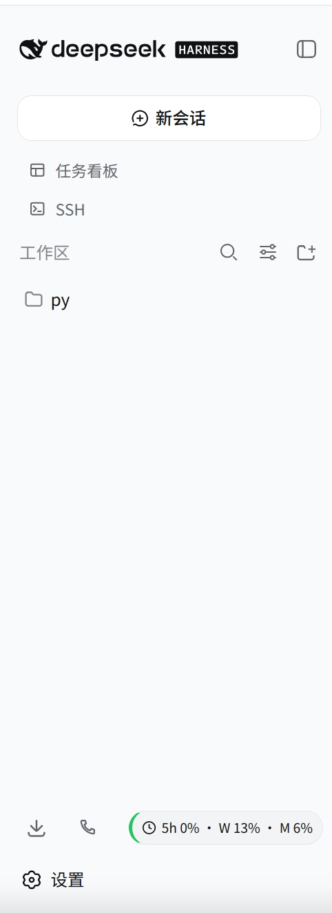
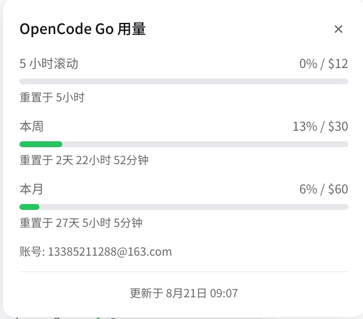

# dsh-opencode-go-usage

DSH 插件：在侧边栏底部显示 OpenCode Go 用量徽章。

## 功能

- 侧边栏底部工具栏显示用量徽章（5h 滚动 / 本周 / 本月）
- 点击徽章展开详细用量面板，含进度条和重置倒计时
- 根据用量自动变色：绿色（< 70%）、黄色（70-90%）、红色（> 90%）
- 每 60 秒自动刷新，可配置刷新间隔和告警阈值
- 仅允许本地回环访问（安全防护）

## 效果预览

### 侧边栏徽章



### 用量详情面板



## 安装

### 一键安装（推荐）

```bash
curl -fsSL https://raw.githubusercontent.com/yk1288/dsh-opencode-go-usage/main/install.sh | bash
```

### 手动安装

```bash
# 进入 DSH web 配置目录
cd ~/.dsh/profiles/web

# 添加插件依赖
pnpm add https://github.com/yk1288/dsh-opencode-go-usage.git
```

安装后重启 DSH：

```bash
dsh web
```

## 配置

安装完成后需要配置 OpenCode Go 凭据，插件才能获取用量数据。

### 获取凭据

1. 浏览器登录 https://opencode.ai
2. 按 F12 打开开发者工具
3. 进入 Application → Cookies，复制 `auth` 的值
4. 从浏览器地址栏获取 workspace ID（格式为 `wrk_xxx`）

### 配置方式

编辑 `~/.opencode-go-usage.json`：

```json
{
  "workspace_id": "wrk_xxx",
  "auth_cookie": "你的 auth cookie 值"
}
```

设置文件权限（仅自己可读）：

```bash
chmod 600 ~/.opencode-go-usage.json
```

### 环境变量（可选）

也可以通过环境变量配置，优先级高于配置文件：

```bash
export OPENCODE_GO_WORKSPACE_ID="wrk_xxx"
export OPENCODE_GO_AUTH_COOKIE="你的 auth cookie 值"
```

## 使用

- **徽章**：安装后自动显示在侧边栏底部下载/电话图标所在行的最右侧
- **点击**：展开用量详情面板，显示各窗口用量百分比和进度条
- **颜色**：
  - 绿色边框：用量 < 70%
  - 黄色边框：用量 70-90%
  - 红色边框：用量 > 90%
- **关闭面板**：点击面板右上角 ✕ 按钮，或按 ESC 键

## 开发

```bash
# 克隆仓库
git clone https://github.com/yk1288/dsh-opencode-go-usage.git
cd dsh-opencode-go-usage

# 安装依赖
pnpm install

# 构建
pnpm build

# 类型检查
pnpm typecheck

# 监听模式（开发时自动重新构建）
pnpm watch
```

## 文件结构

```
├── public/
│   └── client.js        # 客户端模块（ModuleLoader 格式）
├── src/
│   ├── index.ts          # 服务端插件（凭据解析、API 路由、轮询）
│   ├── client/
│   │   └── sidebar-badge.tsx  # 客户端组件（参考，实际运行 public/client.js）
│   ├── fetcher.ts        # OpenCode Go 页面抓取
│   └── types.ts          # TypeScript 类型定义
├── lib/                  # 构建产物（git 忽略）
├── cordis.patch.yml      # DSH 插件注册配置
├── install.sh            # 一键安装脚本
├── package.json
└── README.md
```

## 常见问题

### 徽章不显示

1. 检查 DSH 是否正常启动（`dsh web` 无报错）
2. 检查浏览器控制台是否有 `[dsh-opencode-go-usage]` 相关错误
3. 确认 `~/.opencode-go-usage.json` 已正确配置

### 显示 "Go --" 或暂无数据

1. 确认 `workspace_id` 和 `auth_cookie` 正确
2. 登录 https://opencode.ai 检查账户是否有效
3. 查看 DSH 终端日志中的 `[dsh-opencode-go-usage]` 输出

## License

Apache-2.0
